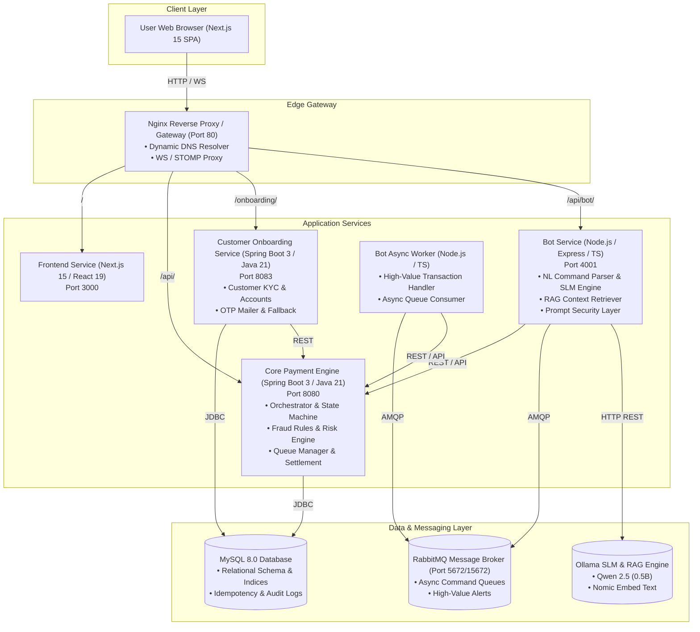
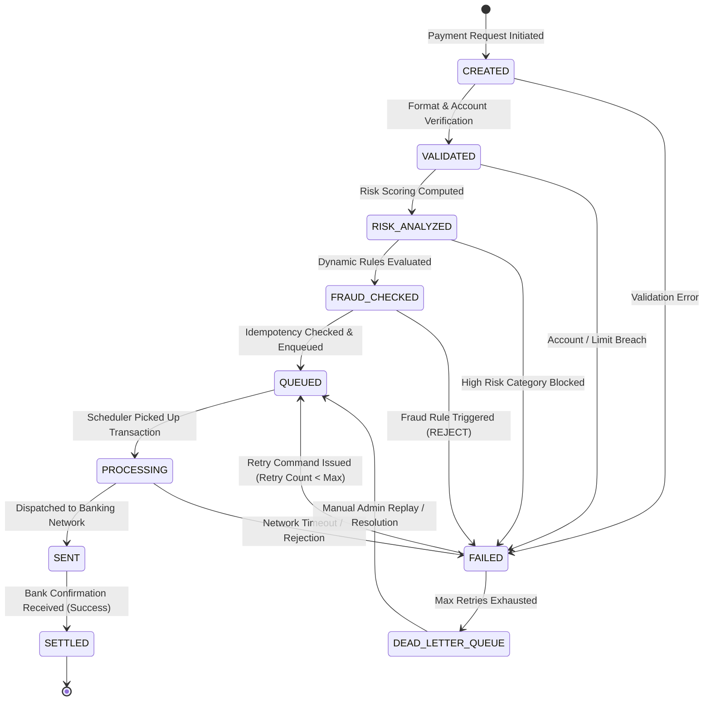
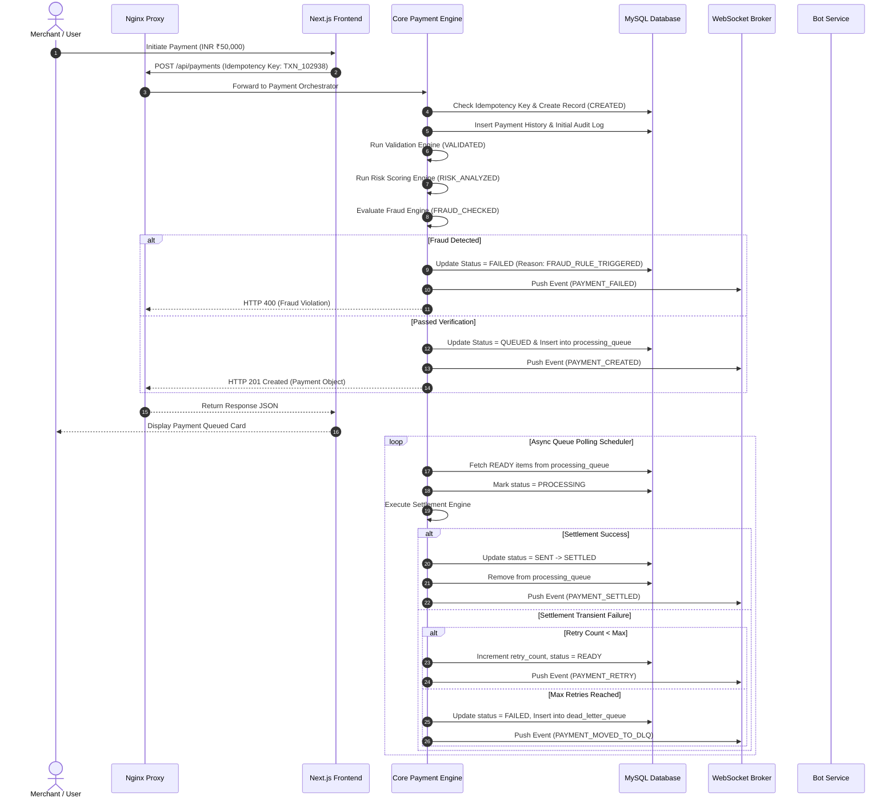
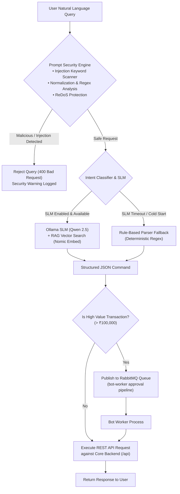
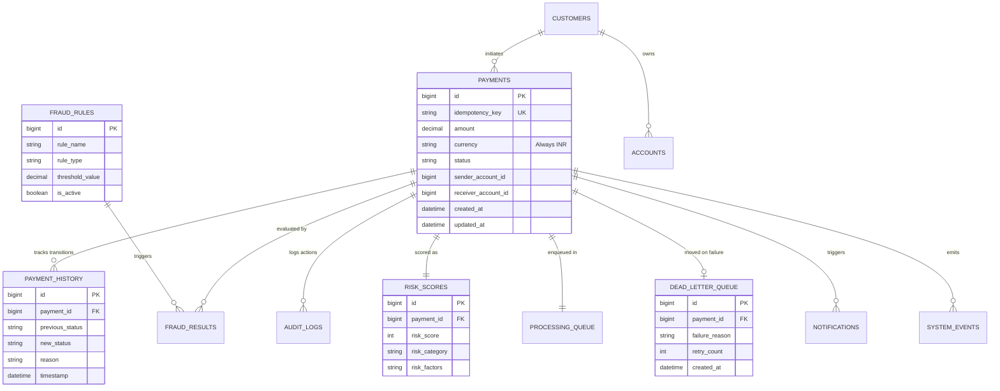

# RupeeX - Payment Processing & Risk Intelligence Platform
## Complete Architecture & Technology Stack Documentation

---

## 1. System Overview & Architecture Goals

**RupeeX** is an enterprise-grade, high-throughput financial payment processing and risk intelligence platform designed for strict INR currency transactions. The platform provides end-to-end payment lifecycle orchestration, dynamic fraud detection, real-time risk scoring, idempotent processing, async retry mechanisms, dead-letter queue (DLQ) management, real-time event streaming via WebSockets, customer onboarding, and an on-premise AI/SLM powered conversational assistant.

### Key Architectural Principles
- **Strict INR Domain Consistency**: All operations, calculations, fee deductions, and financial ledgers strictly enforce INR (Indian Rupee) settlement.
- **Clean Microservices Architecture**: Decoupled, single-responsibility services (Payment Engine, Customer Onboarding, AI Bot Assistant, Gateway Proxy).
- **Deterministic State Machine**: Strict state transition validation (`CREATED` → `VALIDATED` → `RISK_ANALYZED` → `FRAUD_CHECKED` → `QUEUED` → `PROCESSING` → `SENT` → `SETTLED` / `FAILED` / `DEAD_LETTER_QUEUE`).
- **Resilience & Fault Tolerance**: Idempotent APIs, automatic retry policies with backoff, dead-letter queue isolation, and fallback options for external dependencies (e.g., mail, AI inference).
- **Security & Prompt Guarding**: Multi-layer security featuring prompt injection defenses, ReDoS protection, CORS policies, environment segregation, and strict input validation.
- **Real-Time Observability**: Persistent audit logs, event feeds, STOMP WebSockets push to frontend, metrics snapshots, and Actuator health probes.

---

## 2. Overall System Architecture



---

## 3. Technology Stack Overview

The RupeeX platform utilizes a modern, resilient, enterprise tech stack across all layers:

### 3.1 Core Payment Engine (`backend`)
- **Runtime & Framework**: Java 21 LTS, Spring Boot 3.3.8
- **ORM & Data Access**: Spring Data JPA, Hibernate, ByteBuddy 1.15.10 (Java 25 support pinned)
- **Database Connector**: MySQL Connector/J 8.0
- **Real-Time Communication**: Spring WebSocket with STOMP broker messaging (`/api/ws`)
- **API Documentation**: SpringDoc OpenAPI 2.6.0 (Swagger UI at `/swagger-ui`, spec at `/api-docs`)
- **Operational Monitoring**: Spring Boot Actuator (`/actuator/health`, `/actuator/metrics`)
- **Email & Alerts**: Spring Boot Starter Mail (SMTP mailer with dynamic OTP fallback)
- **Testing & Quality Assurance**: JUnit 5, Mockito 5.14.2, Testcontainers 1.20.4 (MySQL/PostgreSQL), H2 In-Memory DB
- **Code Optimization**: Project Lombok 1.18.38

### 3.2 Customer Onboarding Microservice (`onboarding-service`)
- **Runtime & Framework**: Java 21 LTS, Spring Boot 3.3.8
- **Core Domain**: Customer KYC registration, account creation, bank details, fee structure, OTP verification
- **Integration**: Direct REST communication with Core Payment Engine (`/api`) and shared MySQL schema
- **Context Path**: Mounted explicitly under `/onboarding`

### 3.3 AI / SLM Bot Assistant (`bot-service` & `bot-worker`)
- **Runtime**: Node.js (v20+), TypeScript 5.4.2, Express 4.18
- **Asynchronous Messaging**: AMQPLib 0.10.3 connected to RabbitMQ
- **SLM Inference Engine**: Ollama containerized service running **Qwen 2.5 (0.5B)** (`qwen2.5:0.5b`)
- **RAG & Vector Embeddings**: **Nomic Embed Text** (`nomic-embed-text`) with cosine similarity retrieval
- **Security Guardrails**: Custom multi-tier prompt injection scanner, input normalization, ReDoS-safe regex engine
- **Resilience**: Rule-based regex fallback parser if Ollama SLM engine times out (25s) or is cold-starting

### 3.4 Frontend Command Center (`frontend`)
- **Framework**: Next.js 15.3.5 (App Router), React 19.1.1, TypeScript 5
- **Styling**: Vanilla CSS / TailwindCSS v4, Shadcn UI primitives, Lucide React icons
- **State Management**: Zustand 5.0.8 (UI and global session state), TanStack React Query 5.80.10 (Server state & REST mutations)
- **Data Visualizations**: Recharts 2.15.4 (KPIs, latency metrics, fraud distributions)
- **Interactive Process Mapping**: React Flow 11.11.4 (Payment lifecycle flow visualizer)
- **Animations**: Framer Motion 12.23.12 (Transitions, toast updates, timeline progress)
- **Real-Time Feed**: `@stomp/stompjs` 7.1.1 & `sockjs-client` 1.6.1

### 3.5 Infrastructure, Gateway & DevOps
- **Reverse Proxy / API Gateway**: Nginx 1.27 Alpine with dynamic Docker DNS resolution (`127.0.0.11`) and WebSocket upgrade headers
- **Relational Storage**: MySQL 8.0 (`rupeex_db`) with volume persistence (`db_data`)
- **Message Broker**: RabbitMQ 3.11 Management (`guest:guest`)
- **Local AI Infrastructure**: Containerized Ollama instance with volume persistence (`ollama_data`) and automated pull job (`ollama-pull`)
- **Containerization**: Docker, Docker Compose (Dev & Prod profiles: `docker-compose.yml`, `docker-compose.prod.yml`)
- **CI/CD Automation**: Jenkins Pipeline (`Jenkinsfile`) with automated build, static checks, unit tests, and compose deployment

---

## 4. Payment Lifecycle State Machine

Every payment transaction in RupeeX follows a strict, unidirectional state machine. Unlawful state transitions trigger validation exceptions and are rejected immediately.



---

## 5. Microservices Interaction & Data Flow

### 5.1 End-to-End Payment Execution Sequence



---

## 6. AI Bot Assistant & Security Architecture

The `bot-service` accepts natural language commands (e.g., *"Process refund for payment 1029"*, *"Show high risk transactions today"*). It employs a defense-in-depth architecture to ensure safety and accuracy.



---

## 7. Database Entity Relationship Model

The underlying MySQL database schema is structured to guarantee ACID compliance, transaction traceability, and query efficiency:



---

## 8. Deployment & Network Topology

RupeeX is containerized for seamless execution across environments (Development, Staging, and Production).

```mermaid
flowchart TB
    subgraph Host / Cloud Network
        Port80["Port 80 (HTTP Gateway)"]
        Port3306["Port 3306 (MySQL - Local Dev)"]
        Port15672["Port 15672 (RabbitMQ Console)"]
    end

    subgraph Docker Compose Internal Bridge Network ('rupeex-network')
        NginxC["rupeex-nginx (Alpine 1.27)"]
        FrontendC["rupeex-frontend (Next.js 15 / React 19)"]
        AppC["rupeex-app (Spring Boot 3 Backend)"]
        OnboardingC["rupeex-onboarding-app (Spring Boot 3)"]
        BotSvcC["rupeex-bot-service (Node.js/TS)"]
        BotWorkerC["rupeex-bot-worker (Node.js/TS)"]
        DBC["rupeex-db (MySQL 8.0)"]
        RabbitC["rupeex-rabbitmq (RabbitMQ 3.11 Management)"]
        OllamaC["rupeex-ollama (Ollama LLM Engine)"]
    end

    Port80 --> NginxC
    Port3306 --> DBC
    Port15672 --> RabbitC

    NginxC --> FrontendC
    NginxC --> AppC
    NginxC --> OnboardingC
    NginxC --> BotSvcC

    AppC --> DBC
    OnboardingC --> DBC
    OnboardingC --> AppC

    BotSvcC --> RabbitC
    BotSvcC --> OllamaC
    BotSvcC --> AppC
    BotWorkerC --> RabbitC
    BotWorkerC --> AppC
```

---

## 9. Security, Compliance & Resiliency

| Security / Resiliency Feature | Implementation Detail | Location in Repository |
| :--- | :--- | :--- |
| **Prompt Injection Protection** | Multi-layer detection stripping system overrides, jailbreak attempts, and suspicious commands. | `bot-service/src/security.ts` |
| **ReDoS Prevention** | Safe regex matching with length limits and non-backtracking patterns to prevent CPU exhaustion attacks. | `bot-service/src/security.ts` |
| **API Idempotency Guarantee** | Idempotency Key check on all `POST /payments` requests to prevent double charges. | `backend/.../service/IdempotencyService.java` |
| **State Machine Integrity** | Enum-based state transition verification preventing illegal workflow mutations. | `backend/.../platform/service/PaymentStateMachine.java` |
| **INR Currency Consistency** | Hard validation rejecting non-INR currency transactions to preserve financial integrity. | `backend/.../platform/service/PaymentOrchestrationService.java` |
| **Dead-Letter Queue Isolation** | Automatic isolation of transactions exceeding max retry thresholds (`max_retries = 3`). | `backend/.../repository/DeadLetterQueueRepository.java` |
| **Secrets Management** | Zero plain-text credentials in repository; configured via `.env` and environment injection. | `.env.example`, `docker-compose.yml` |

---

## 10. Repository Structure Quick Reference

```text
108-01-RupeeX-payment-processing/
├── ARCHITECTURE.md                  # Complete System Architecture & Tech Stack Docs
├── README.md                        # Project Overview & Getting Started Guide
├── AGENTS.md                        # AI Agent & Contributor Interaction Rules
├── SKILL.md                         # Engineering Standards & Code Quality Guidelines
├── CI_CD.md                         # CI/CD Deployment Documentation
├── docker-compose.yml               # Local Development Stack
├── docker-compose.prod.yml          # Production Docker Compose Profile
├── Jenkinsfile                      # CI/CD Pipeline Definition
├── nginx/
│   └── nginx.conf                   # Reverse Proxy & Routing Rules
├── backend/                         # Core Payment Spring Boot 3 Engine
│   ├── pom.xml                      # Maven Dependencies (Java 21, Spring Boot 3.3.8)
│   └── src/main/
│       ├── java/com/rupeex/main/    # Controllers, Services, State Machine, Engines
│       └── resources/schema.sql     # Reference DDL Database Schema
├── onboarding-service/              # Customer Onboarding Microservice
│   └── src/main/java/               # KYC, Accounts & Mail OTP Service
├── bot-service/                     # AI Assistant & Worker Service
│   ├── src/                         # SLM, RAG Engine, Prompt Security, Worker
│   └── package.json                 # Node.js Dependencies & Scripts
└── frontend/                        # Next.js 15 Command Center Dashboard
    ├── src/app/                     # App Router Pages & Components
    └── package.json                 # React 19, Tailwind, Zustand, Recharts, React Flow
```

---
*Documentation updated & verified for RupeeX Payment Processing & Risk Intelligence Platform.*
