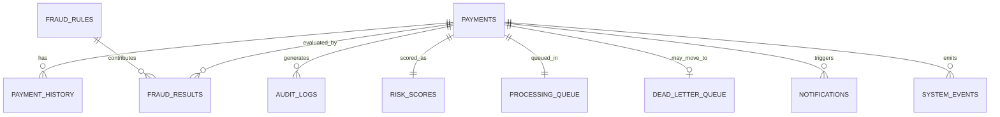
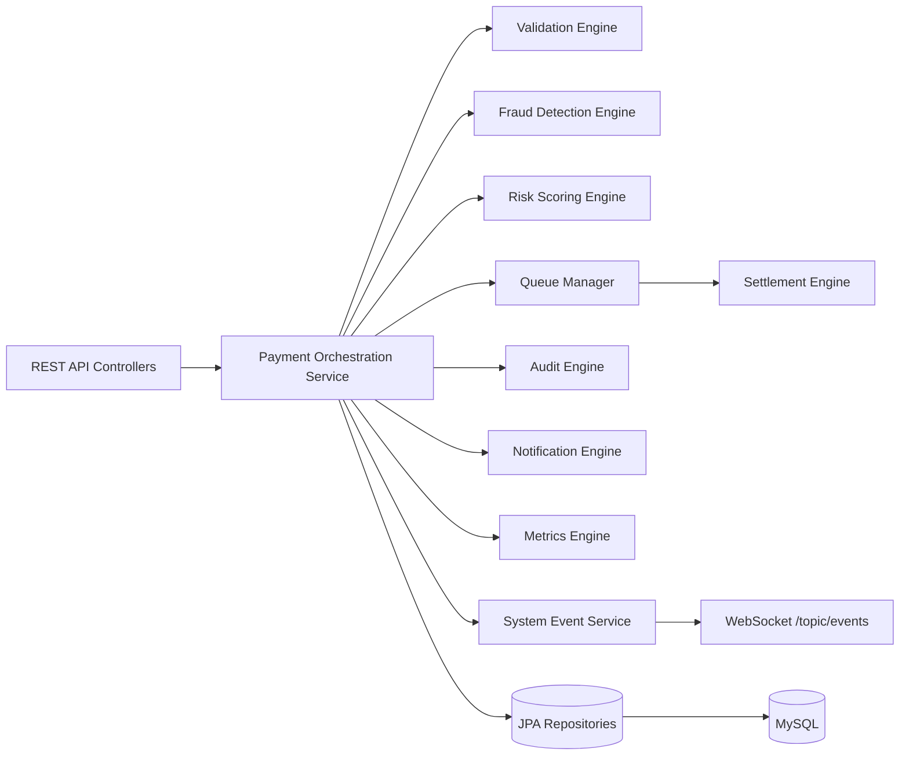
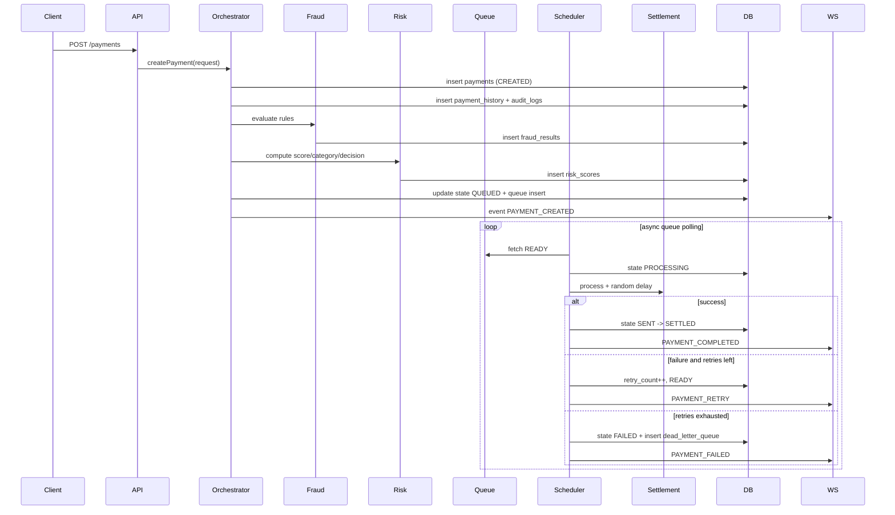
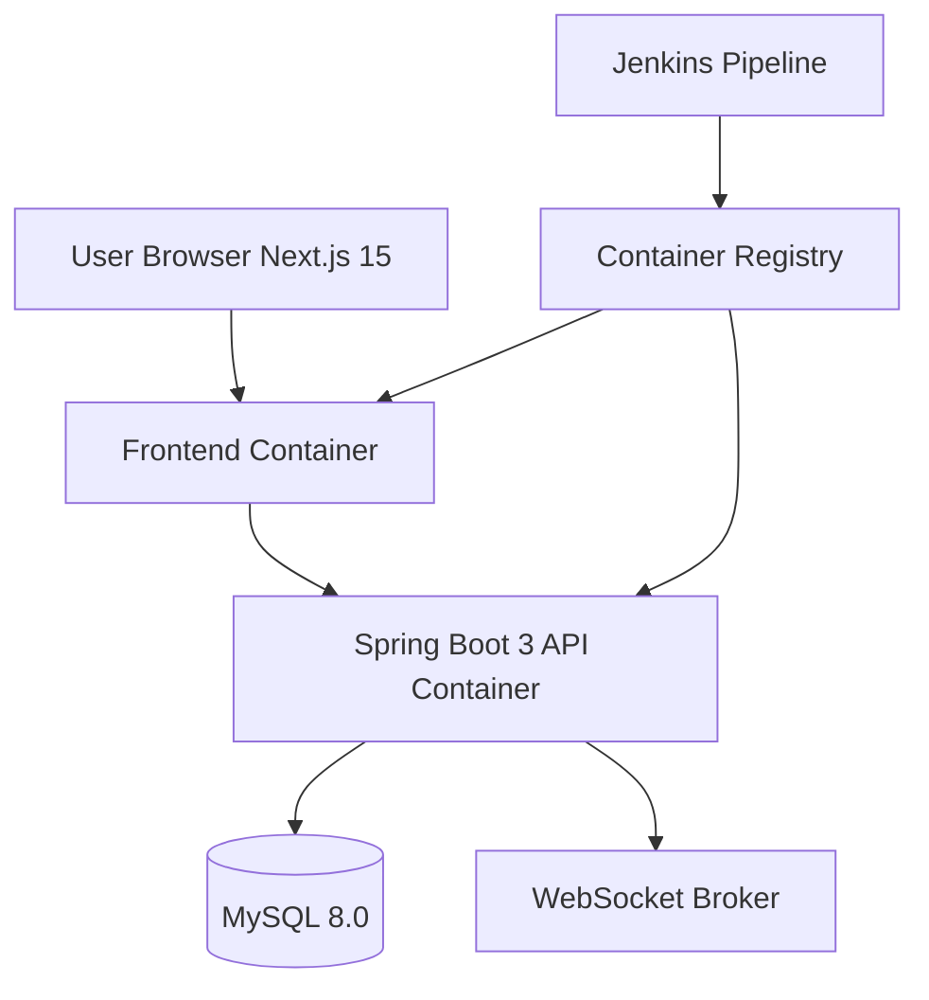

# Payment Processing & Risk Intelligence Platform

## 1. Complete Software Architecture

### Architecture Style

- Clean Architecture with modular engines.
- Domain-first design centered on payment lifecycle state transitions.
- Event-driven internals through persisted system events and WebSocket push.
- Asynchronous settlement processing via queue scheduler and retry policy.

### Logical Layers

- Controller Layer: REST APIs for Payments, Fraud Rules, Metrics, Dashboard, Events.
- Service Layer: orchestrates use cases, transaction boundaries, idempotency, and retries.
- Engine Layer: validation, fraud detection, risk scoring, queue manager, settlement, audit, metrics, notification.
- Repository Layer: Spring Data JPA data access.
- Infrastructure Layer: MySQL, Docker, Jenkins, WebSocket broker.

## 2. Folder Structure

```text
src/main/java/com/rupeex/main
├── config
│   ├── AsyncConfig.java
│   └── WebSocketConfig.java
├── controller
│   ├── PaymentPlatformController.java
│   ├── FraudRuleController.java
│   ├── PlatformMetricsController.java
│   └── PaymentController.java (legacy)
├── entity
│   ├── Payment.java
│   ├── PaymentHistory.java
│   ├── AuditLog.java
│   ├── FraudRule.java
│   ├── FraudResult.java
│   ├── RiskScore.java
│   ├── ProcessingQueueEntry.java
│   ├── DeadLetterQueueEntry.java
│   ├── NotificationRecord.java
│   └── SystemEvent.java
├── enums
│   ├── PaymentStatus.java
│   ├── FraudRuleType.java
│   └── RiskCategory.java
├── platform
│   ├── dto
│   │   ├── PaymentPlatformRequest.java
│   │   ├── PaymentPlatformResponse.java
│   │   ├── FraudRuleRequest.java
│   │   └── MetricsSnapshotResponse.java
│   └── service
│       ├── PaymentOrchestrationService.java
│       ├── PaymentStateMachine.java
│       ├── FraudDetectionEngineService.java
│       ├── RiskScoringEngineService.java
│       ├── QueueProcessingScheduler.java
│       ├── SettlementEngineService.java
│       ├── AuditEngineService.java
│       ├── NotificationEngineService.java
│       ├── MetricsEngineService.java
│       └── SystemEventService.java
└── repository
    ├── PaymentRepository.java
    ├── PaymentHistoryRepository.java
    ├── FraudRuleRepository.java
    ├── FraudResultRepository.java
    ├── RiskScoreRepository.java
    ├── ProcessingQueueRepository.java
    ├── DeadLetterQueueRepository.java
    ├── AuditLogRepository.java
    ├── NotificationRecordRepository.java
    ├── PaymentMetricRepository.java
    └── SystemEventRepository.java
```

## 3. Database Schema (Normalized)

- Core tables: payments, accounts, payment_history, audit_logs.
- Fraud/Risk: fraud_rules, fraud_results, risk_scores.
- Processing: processing_queue, dead_letter_queue.
- Ops/Observability: notifications, payment_metrics, system_events.

Reference DDL is in `backend/src/main/resources/schema.sql`.

## 4. Entity Relationships



## 5. UML Diagrams

### Component Diagram



### Sequence Diagram (Payment Lifecycle)



### Deployment Diagram



## 6. API Documentation (Production-Style)

- POST /payments: create payment with idempotency key.
- GET /payments: paginated payment listing.
- GET /payments/{id}: payment details including risk/fraud context.
- POST /payments/{id}/retry: move failed/DLQ payment back to queue.
- POST /payments/{id}/cancel: cancel in-flight queued payment.
- GET /payments/{id}/history: lifecycle transition history.
- GET /metrics: operational metrics snapshot.
- GET /fraud/rules: list dynamic fraud rules.
- POST /fraud/rules: create fraud rule.
- PUT /fraud/rules/{id}: update fraud rule.
- DELETE /fraud/rules/{id}: delete fraud rule.
- GET /dashboard: command center card metrics.
- GET /events: latest event feed.
- GET /health: service health.

Swagger UI: /swagger-ui
OpenAPI docs: /api-docs

## 7. Backend Implementation Plan

1. Stabilize payment lifecycle state machine and hard transition validation.
2. Add dedicated validation policies and policy registry.
3. Replace scheduler polling with message broker abstraction (Kafka/Rabbit) for horizontal scale.
4. Add outbox pattern for event reliability.
5. Add distributed idempotency lock (Redis).
6. Add explicit failure injection API for chaos simulation.
7. Add replay API for flight recorder timeline.

## 8. Frontend Implementation Plan

1. Next.js 15 App Router pages:
   - Dashboard, Payments, Payment Details, Fraud Center, Risk Center, Rules, DLQ, Reports, Audit Logs, Settings.
2. State and data:
   - React Query for API fetching/mutations.
   - Zustand for UI/session state.
   - WebSocket client for live updates.
3. Visualization:
   - Recharts for KPIs, trends, latency/risk distributions.
   - React Flow for interactive payment journey animation.
   - Framer Motion for stage transitions and timeline playback.
4. UI system:
   - TailwindCSS + ShadCN components with responsive banking console layout.

## 9. Docker Setup

- Backend Dockerfile: multi-stage Maven build -> Temurin 21 runtime.
- docker-compose.yml:
  - mysql:8.0
  - spring boot app
  - next.js frontend
- Health checks:
  - db: pg_isready
  - app: actuator health endpoint (recommended for compose healthcheck extension).

## 10. Jenkins Pipeline

Pipeline stages:

1. Checkout
2. Generate .env from Jenkins credentials
3. Docker sanity checks
4. Stop previous compose deployment
5. Build images
6. Deploy compose stack
7. Smoke logs verification
8. Cleanup workspace

Recommended extension:

- Add stages for unit tests, integration tests, security scan, and quality gate before deploy.

## 11. Development Roadmap (MVP -> Platform Scale)

### MVP (2-3 sprints)

- Payments lifecycle orchestration
- Fraud rules + risk scoring
- Queue/retry/DLQ
- Metrics/event feed
- Basic dashboard UI

### Production Hardening (next 3-5 sprints)

- Outbox + event broker
- Distributed lock/idempotency
- Advanced failure injection
- Replay timeline and flight recorder APIs
- SLO dashboards and alerting

### Platform Scale (next 2 quarters)

- Multi-region active-active architecture
- RTO/RPO runbooks and chaos testing
- Data retention and archival policies
- Regulatory audit export controls
- Zero-downtime schema migrations

## 12. Architectural Decisions Explained

- State Machine: prevents illegal state mutation and creates deterministic lifecycle behavior.
- Database-driven Fraud Rules: enables policy teams to tune risk without code releases.
- Async Queue + Retry + DLQ: isolates transient failures, protects throughput, and ensures inspectability.
- Persisted Audit + Event Feed: supports traceability, compliance, and real-time operational visibility.
- Risk Explainability: stores rule-level contributions for transparent decisions and model governance.
- WebSocket Event Push: lowers operational latency for command-center style UI updates.
- Clean Architecture Separation: improves testability, replacement agility, and ownership boundaries.
